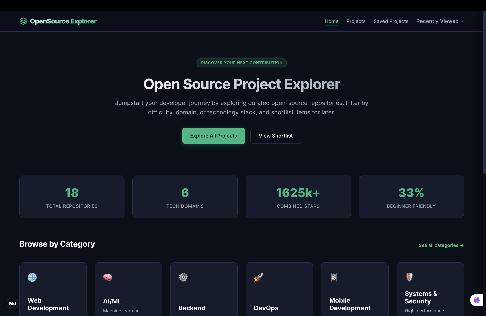
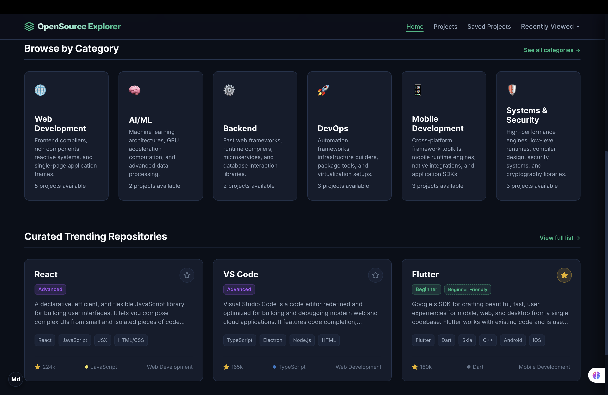
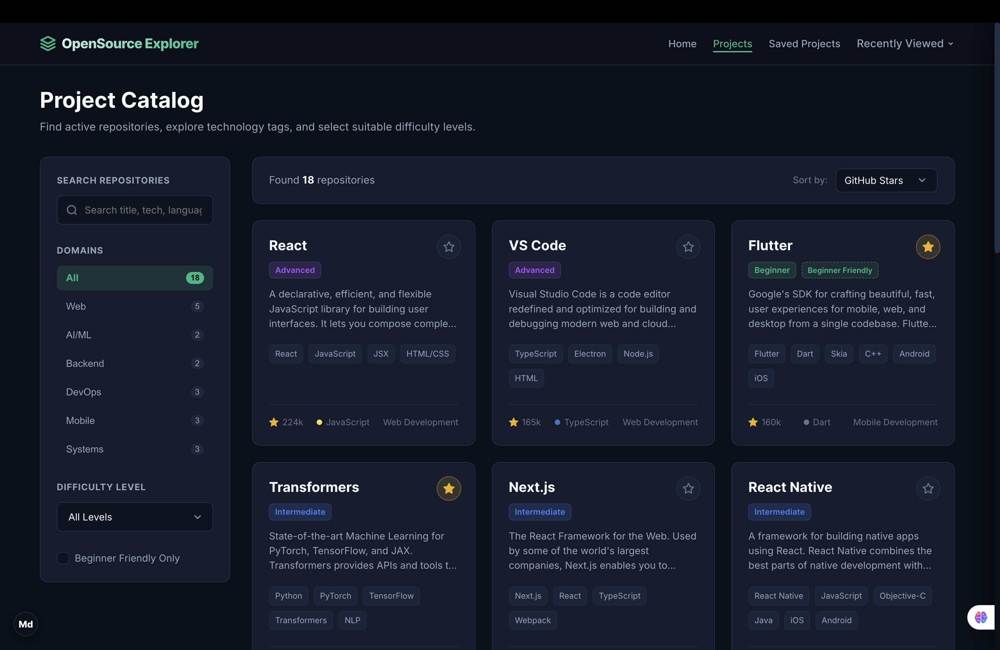
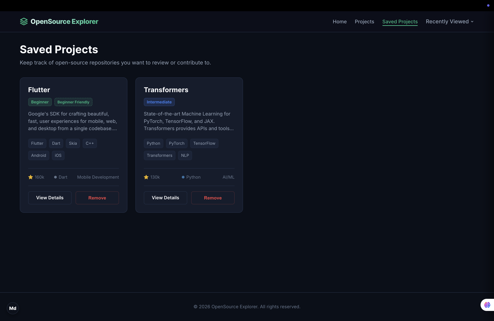
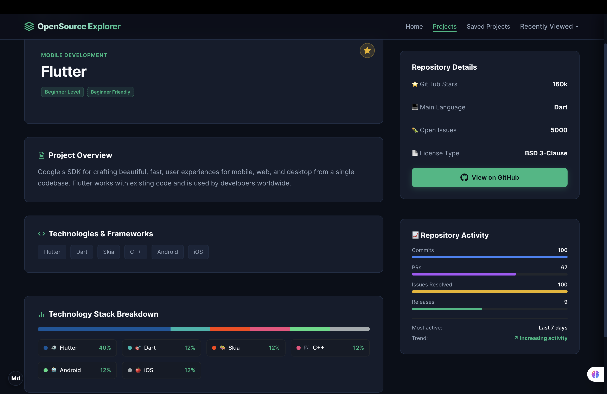
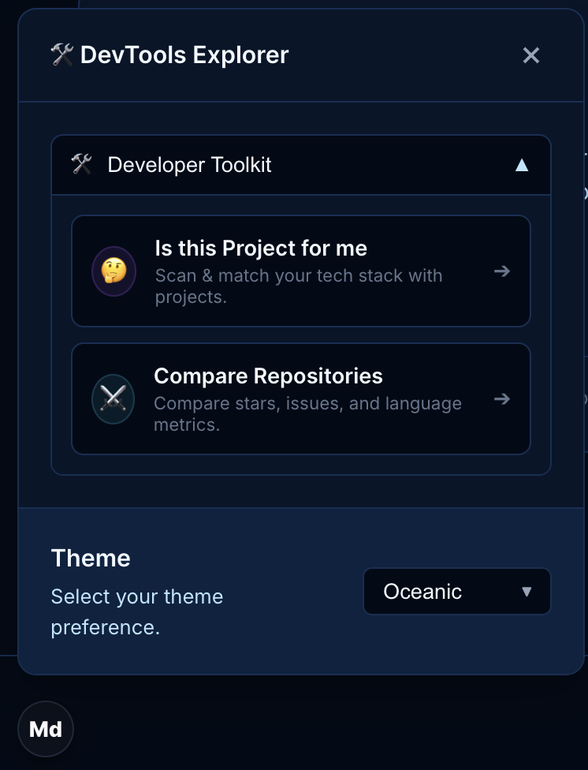
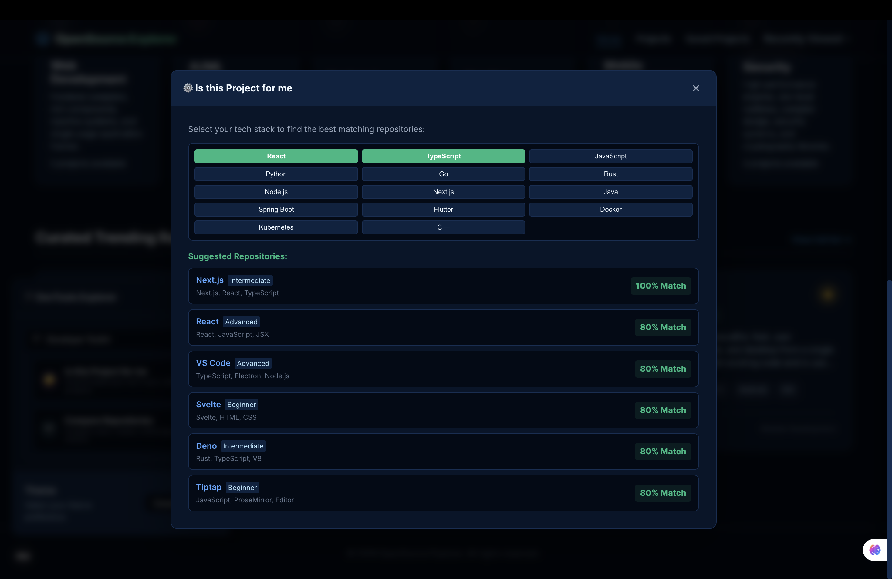

# Open Source Project Explorer

## ℹ️ About

Open Source Project Explorer is a premium, responsive web application designed to help developers search, discover, and track open-source projects. It aggregates repository attributes (stars, open issues, language, and custom technology stacks) and parses them into a highly interactive, unified developer portal.

---

## 🚀 Features

* **Advanced Search & Multi-Filter Catalog**: Users can filter repositories by tech domains (Web, AI/ML, Backend, DevOps, Systems, Mobile), programming difficulty, and toggle "Beginner Friendly Only" tags.
* **Tech Stack Breakdown**: Programmatically visualizes exact technology usage percentages and activity indicators for each repository.
* **Interactive Developer Toolkit (DevTools)**:
  * **Is this Project for me?**: Input custom tech stacks to dynamically match compatibility with catalog items.
  * **Compare Repositories**: Align two repositories side-by-side to compare stars, open issues, languages, and action links.
* **Custom Theme Controller**: Easily switch between Minimalist Light, Classic Dark, Cyberpunk, and Oceanic Deep themes with real-time UI synchronization.
* **Recently Viewed Dropdown**: Keeps track of the last 5 visited project detail pages and lists them dynamically in the navigation header.
* **Reactive Bookmarking**: Save and persist bookmarked repositories locally. Use custom browser window event listeners to synchronize bookmark badges across pages.
* **Static Site Generation (SSG)**: Fast-loading static project detail pages auto-generated at build-time using `generateStaticParams`.

---

## 📸 Application Screenshots

### 🖥️ Discover Dashboard (Home)





### 📂 Dynamic Project Details







### 🛠️ Interactive DevTools Drawer





---

## 🛠️ Technology Stack

* **Core Framework**: Next.js 16 (App Router)
* **View Library**: React 19
* **Styling**: Vanilla CSS3 Custom Properties (CSS variables)
* **Persistence**: Web Storage API (`localStorage`)
* **Package Manager**: npm

---

## 📁 Project Architecture

```text
OpenSourceProject/
├── app/
│   ├── globals.css           # Styling theme tokens and global rules
│   ├── layout.js             # Root layout with Inter font and Navbar
│   ├── page.js               # Home dashboard view & dynamic stats
│   ├── not-found.js          # Fallback custom 404 page
│   ├── projects/
│   │   ├── page.js           # Server Component fetching URL parameters
│   │   └── [id]/
│   │       └── page.js       # Static generated details page
│   └── saved/
│       └── page.js           # Client Component for saved bookmarks
├── components/
│   ├── Navbar.js             # Navigation header tracking route state
│   ├── ProjectCard.js        # Repository block card supporting actions mode
│   ├── ProjectExplorer.js    # Multi-filter search control panel
│   └── BookmarkButton.js     # React client bookmark state toggle
├── lib/
│   └── projects.js           # Shared database of open source repositories
├── public/
│   └── screenshots/          # Application screenshot images
├── jsconfig.json             # Absolute path mapping (@/* -> ./*)
├── package.json              # Dependency declarations
└── README.md                 # Project documentation
```

---

## 🌐 Live Demo

You can view the live deployment of this project on Vercel here:
[👉 OpenSource Project Explorer - Live Demo](https://open-source-explorer-ten.vercel.app/)

---

## ⚙️ Getting Started

### Local Development

1. **Install Dependencies**:
   ```bash
   npm install
   ```

2. **Start Development Server**:
   ```bash
   npm run dev
   ```
   Open [http://localhost:3000](http://localhost:3000) in your web browser.

### Production Build

Compile, build, and optimize the application for production:
```bash
npm run build
npm run start
```

---

## 💡 What I Learned

During the design and construction of this application, I acquired and refined several core web engineering concepts:
* **React 19 & Next.js 16 Routing**: Learned how to build server-side rendered structures combined with client-side interactive slots, using static path pre-generation (`generateStaticParams`) for fast load times.
* **Vanilla CSS Customization**: Styled the entire application from scratch with raw CSS custom variables, implementing modern dark/light/cyberpunk/oceanic themes without relying on heavy utility frameworks like Tailwind CSS.
* **Component Communication via DOM Events**: Synchronized state across decoupled React components (such as Navbar bookmarks and detail pages) using custom global `window.dispatchEvent` events rather than heavy state-management libraries.
* **Local Persistence Workflows**: Integrated `localStorage` parsing pipelines to save themes, bookmarks, goal trackers, and recently viewed project history directly in the browser.
